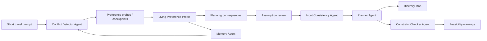
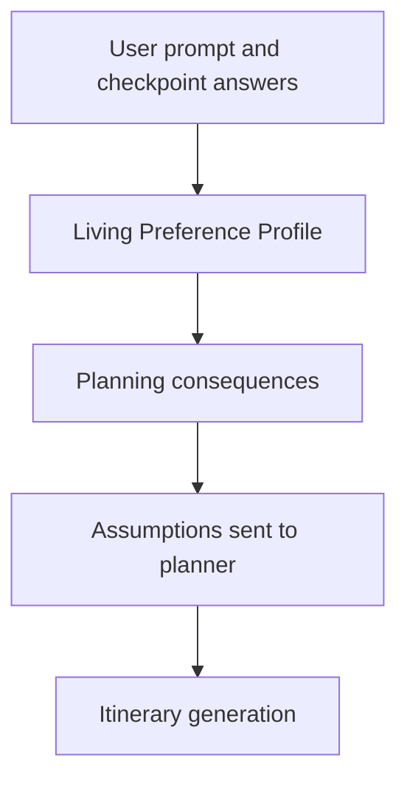

# Assumption-Aware Travel Planning Through Hidden Preference Elicitation

## Abstract

This project is a research prototype for ambiguity-first travel planning. It addresses a common limitation of conversational travel assistants: users often begin with short, underspecified prompts, while itinerary generators silently fill missing details with opaque assumptions. The prototype reframes travel planning as an iterative preference-discovery problem rather than a form-completion task. It detects latent trade-offs in vague prompts, asks lightweight checkpoint questions, converts answers into a living preference profile, exposes how those preferences affect planning behavior, and generates a spatial-temporal itinerary with feasibility checks.

The system combines hidden preference elicitation, multi-agent visibility, and user controllability. Hidden preference elicitation is the primary contribution: the planner identifies decision-relevant uncertainties such as comfort versus depth, budget versus convenience, iconic sights versus local exploration, activity density versus recovery, and flexibility versus booking certainty. Multi-agent visibility supports this by showing which agents made which inferences and why. Controllability is provided through editable learned preferences, adjustable planning consequences, assumption review, route inspection, and memory reset/new-session controls.

## 1. Research Motivation

Most real users do not start travel planning with complete requirements. A first prompt is commonly brief:

- "Plan a trip to Japan"
- "Italy for one week"
- "Somewhere warm"
- "Cheap trip to Europe"
- "I have 5 days off"

Such prompts leave many high-impact variables unspecified: pace, budget, transport tolerance, walking load, accommodation expectations, travel style, risk tolerance, must-see priorities, and whether the user values convenience or novelty. A conventional itinerary generator may respond immediately with a plausible plan, but that plan can encode hidden assumptions that the user never approved.

The prototype therefore treats ambiguity as the normal starting condition. Its design goal is not simply to gather more information, but to help users discover preferences that matter for the plan. This shifts the interaction from static preference collection to conflict-based hidden preference elicitation.

## 2. Core Research Question

The project investigates how an AI travel planner can elicit hidden preferences from vague travel prompts while preserving user understanding and control over the planning process.

The central research question is:

How can a multi-agent travel planning system transform underspecified user intent into an explainable, controllable itinerary by detecting latent preference conflicts and exposing their downstream planning consequences?

This decomposes into three sub-questions:

1. How can the system identify which missing preferences are worth asking about?
2. How can users understand and control the learned preference model without being forced into a long questionnaire?
3. How can the final itinerary make visible the consequences of those preferences in routing, pacing, accommodation, cost, and feasibility?

## 3. System Overview

The prototype is implemented as a Next.js and TypeScript application with modular backend agents. The frontend provides a guided planning workspace with two main modes:

- Itinerary Map: spatial exploration of the generated trip route.
- Review Planning Assumptions: inspection and control of hidden preferences, planning consequences, assumptions, detailed itinerary, and feasibility warnings.

The backend uses structured JSON outputs validated by Zod schemas. This is important for research instrumentation: each agent produces inspectable, typed artifacts rather than unstructured prose.

The main workflow is:



## 4. Workflow Details

### 4.1 Ambiguity-First Input

The user enters a short, natural prompt in the floating prompt composer. The system expects this input to be incomplete. Rather than treating missing details as an error, the system interprets the prompt as a signal of initial intent and searches for hidden conflicts that could materially change the trip.

The prompt is sent to the analysis API with:

- current prompt text
- browser-local memory
- previously learned preferences
- selected interface language

### 4.2 Conflict Detection

The Conflict Detector Agent analyzes the prompt before itinerary generation. It does not ask generic category questions such as "What is your pace?" Instead, it identifies latent conflicts and uncertain planning assumptions.

Each detected conflict contains:

- conflict id
- title
- explanation
- hidden preference to uncover
- confidence score
- probe question
- concrete answer options
- planning impact of each option

The agent also outputs a checkpoint decision:

- whether this is a planning task
- whether a checkpoint is needed
- the best checkpoint stage
- missing preference categories
- assumption risk
- expected plan impact
- interaction cost
- rationale

This makes the system selective. It only interrupts the user when the expected value of asking is high enough relative to the interaction cost.

### 4.3 Preference Probes

Preference probes are generated from conflicts. The probe options are meaningful travel trade-offs rather than abstract levels. For example, instead of "Low / Medium / High pace," a probe may ask whether the user prefers a more comfortable itinerary with lower travel burden or is willing to accept longer transfers for more distinctive experiences.

The selected option is converted into a structured preference answer:

- conflict id
- selected option id
- answer text
- planning impact

This answer becomes evidence for the learned user model.

### 4.4 Living Preference Profile

The Living Preference Profile is the central user model. It answers:

"Is this true about me?"

Each learned preference includes:

- id
- source conflict
- category
- label
- value
- planning impact
- source
- confidence

The user can control each preference by:

- setting it active or ignored
- assigning priority: primary, normal, or lower
- editing the preference text

This section is intentionally primary because hidden preference elicitation is the main research object. Editing the profile changes the user model and may regenerate downstream planning consequences.

### 4.5 Planning Consequences

Planning consequences are downstream planner behaviors generated from active preferences. They answer:

"How should this affect this itinerary?"

For example, a preference such as "I value comfort and convenience" may produce consequences such as:

- reduce long transfers
- prefer convenient accommodation areas
- allow higher accommodation budget
- avoid high walking-load days

These consequences are not treated as new preferences. They are planner behaviors that operationalize the preference profile for the current trip. Users can use or exclude them from the plan, but they mostly edit the Living Preference Profile rather than micromanaging every consequence.

This distinction is central to the interface:



### 4.6 Assumption Review

Before final itinerary generation, the user can review assumptions related to:

- general preferences
- transport
- accommodation
- cost

Transport assumptions include mode, estimated time, travel burden, and rationale. Accommodation assumptions include where the traveler sleeps, whether accommodation changes, and confidence. Cost assumptions include category-level estimates and the basis for those estimates.

The purpose of this stage is to prevent silent planner commitments. The user can confirm, edit, or exclude assumptions before they shape the final itinerary.

### 4.7 Input Consistency Check

Before calling the planner, the Input Consistency Agent checks whether the current request and preferences are coherent. For example, if the user asks for a Europe trip but marks Tokyo as a required city, the system should block or warn before generating a contradictory itinerary.

The consistency output includes:

- canProceed flag
- issue category
- severity
- message
- conflicting inputs
- recommendation

This supports correctness and reduces hallucinated reconciliation of incompatible constraints.

### 4.8 Itinerary Generation

The Planner Agent receives:

- prompt
- detected conflicts
- probe answers
- active learned preferences
- assumptions
- transport assumptions
- accommodation assumptions
- cost assumptions
- confirmed preferences
- memory
- language

It outputs a structured itinerary with:

- destination
- duration
- selected option
- itinerary options
- day plans
- activities
- accommodation per day
- cost breakdowns
- map places
- route segments
- preference influence explanations

The planner is instructed to represent the itinerary as a continuous route, including:

- within-day movement
- base or accommodation transitions
- inter-day transitions
- route reliability
- estimated distance and duration
- transport mode
- related preference or consequence

### 4.9 Spatial-Temporal Itinerary Map

The Itinerary Map is designed as the spatial exploration mode. It answers:

"Where am I going, how do I move, and does the route feel realistic?"

The map uses the structured `mapPlaces` and `routeSegments` returned by the backend. It avoids hard-coded travel content. Route segments distinguish real, estimated, and missing routes; uncertain segments can be shown with dashed styling or warnings.

The map supports:

- full-trip view
- day-by-day view
- destination markers
- stop popups
- route segment popups
- route summary
- warning indicators
- links back to the review tab

The map is not intended to duplicate the full assumption UI. It gives lightweight spatial explanations and directs users to the review workspace for detailed editing.

### 4.10 Feasibility Checking

After itinerary generation, the Constraint Checker Agent reviews the plan for:

- walking load
- travel time
- budget mismatch
- booking risk
- opening-hours risk
- pacing issues

Warnings are structured by type, impact, affected day, message, recommendation, and status. This makes feasibility visible without requiring the planner to rewrite its own output.

### 4.11 Memory And Session Continuity

The Memory Agent stores confirmed preferences in browser localStorage. Memory is used only as context for later prompts and should not override contradictory current input. The user can start a new session to clear persisted workflow state and prevent earlier prompts from influencing future requests.

The app also persists workflow state so a browser refresh can restore:

- original prompt
- detected conflicts
- probe answers
- learned preferences
- assumptions
- generated itinerary
- feasibility warnings
- current workflow step
- UI expansion state where practical

## 5. Multi-Agent Architecture

The prototype uses agents as functional modules rather than autonomous chat personas. Each agent has a constrained responsibility and emits typed JSON.

### Conflict Detector Agent

Role: identifies hidden preference conflicts and checkpoint need.

Contribution: converts ambiguity into targeted elicitation opportunities.

### Preference Probe Agent

Role: converts answered trade-off probes into learned preferences and downstream assumptions.

Contribution: bridges user interaction and the living preference profile.

### Assumption Critic Agent

Role: reviews assumptions and flags high-impact or risky ones.

Contribution: increases visibility of uncertainty before planning.

### Input Consistency Agent

Role: detects contradictions and infeasible combinations before itinerary generation.

Contribution: protects the planner from producing incoherent plans from inconsistent inputs.

### Planner Agent

Role: generates structured itinerary options using active learned preferences and accepted assumptions.

Contribution: operationalizes the preference profile into daily activities, route segments, accommodation, and cost.

### Constraint Checker Agent

Role: checks generated plans for feasibility risks.

Contribution: separates plan generation from plan critique.

### Memory Agent

Role: stores and retrieves browser-local preferences.

Contribution: supports continuity across prompts while preserving user control through reset/new-session behavior.

## 6. Data Model

The system uses Zod schemas and TypeScript types for validation. Key entities include:

- `DetectedConflict`
- `ConflictProbeOption`
- `PreferenceProbeAnswer`
- `LearnedPreference`
- `Assumption`
- `TransportAssumption`
- `AccommodationAssumption`
- `CostAssumption`
- `InputConsistencyIssue`
- `Itinerary`
- `ItineraryOption`
- `ItineraryDay`
- `Activity`
- `MapPlace`
- `RouteSegment`
- `CostBreakdownItem`
- `ConstraintWarning`
- `MemoryStatus`

Structured validation matters because it turns LLM behavior into inspectable system state. The UI does not need to parse arbitrary prose to understand whether an assumption is confirmed, whether a route is estimated, or whether a warning is high impact.

## 7. Interface Design Rationale

The interface separates two modes of interaction.

### Itinerary Map

Purpose: spatial exploration.

This mode helps users build a mental model of the route. It emphasizes map scale, destination order, travel flow, transport modes, and route warnings. It avoids long itinerary cards and full assumption editing.

### Review Planning Assumptions

Purpose: inspection, reasoning, and control.

This mode centralizes the preference profile, planning consequences, assumptions, detailed itinerary, costs, transport, accommodation, feasibility checks, and agent evidence. It is allowed to be information-rich because the user intentionally enters it to inspect the plan.

This separation reduces cognitive load. The map answers "Where am I going?" while the review tab answers "Why was this plan created and what can I change?"

## 8. Innovation Points

### 8.1 Conflict-Based Hidden Preference Elicitation

The system does not begin with a fixed preference form. It detects latent conflicts from the prompt and asks deeper trade-off questions only when they are likely to affect planning.

### 8.2 Checkpoint Decision Model

The checkpoint mechanism estimates whether an interruption is worthwhile using assumption risk, expected plan impact, and interaction cost. This supports selective elicitation rather than exhaustive questioning.

### 8.3 Living Preference Profile

The user model is exposed as an editable profile. Users can inspect what the system believes about them, mark preferences active or ignored, change priority, and edit preference content.

### 8.4 Separation Of Preferences And Consequences

The prototype distinguishes learned preferences from itinerary-specific planning consequences. This is important because a preference is a claim about the user, while a consequence is a planning behavior applied to one trip.

### 8.5 Agent Visibility Without Process Overload

Agent outputs are visible through concise traces, evidence trails, confidence values, and rationales. Visibility supports trust and controllability without forcing the user to inspect raw agent logs.

### 8.6 Spatial-Temporal Route Representation

The itinerary map represents the trip as ordered movement rather than isolated day clusters. Route segments carry mode, duration, distance, confidence, and reliability, making travel burden legible.

### 8.7 Structured LLM Outputs With Runtime Validation

All major backend outputs are JSON objects validated by schemas. Invalid or malformed outputs fail early rather than becoming misleading UI state.

### 8.8 Memory With Explicit Control

Session memory supports continuity, but the UI shows whether memory is being used and provides reset/new-session controls. This prevents hidden stale context from silently shaping new requests.

## 9. Example Interaction Pattern

User prompt:

```text
Italy for one week
```

The system may detect conflicts such as:

- classic highlights versus slower local immersion
- budget train travel versus convenience transfers
- many cities versus lower travel burden
- hotel comfort versus lower total cost

Instead of asking a static list of preference fields, it asks a small number of high-impact trade-off questions. The user's answers update the Living Preference Profile. Active preferences generate planning consequences, which shape itinerary routing, daily pacing, accommodation choices, and cost assumptions. The itinerary map then shows the resulting trip route, while the review tab explains why the plan looks the way it does.

## 10. Evaluation Strategy

The prototype can support several scientific evaluation dimensions.

### 10.1 Preference Discovery Quality

Possible measures:

- number of hidden preferences discovered from short prompts
- user agreement with learned preferences
- correction rate after profile inspection
- perceived helpfulness of conflict probes

### 10.2 Cognitive Load

Possible measures:

- perceived burden of answering checkpoints
- comparison against a static preference form
- time to reach a satisfactory plan
- number of unnecessary questions asked

### 10.3 Controllability

Possible measures:

- user ability to predict what editing a preference will change
- successful use of active/ignore and priority controls
- successful correction of wrong assumptions
- perceived control over final itinerary

### 10.4 Multi-Agent Visibility

Possible measures:

- user understanding of why a plan was generated
- perceived transparency of agent reasoning
- trust calibration after viewing evidence trails and feasibility warnings

### 10.5 Itinerary Quality And Feasibility

Possible measures:

- route coherence
- feasibility warning precision
- walking and travel burden alignment with preferences
- consistency between stated preferences and itinerary decisions

## 11. Research Claims Supported By The Prototype

The prototype is designed to support the following claims:

1. Hidden preference elicitation can be framed as conflict detection rather than category completion.
2. Selective checkpoints can reduce unnecessary questioning while preserving plan quality.
3. A living preference profile gives users a more understandable control surface than raw assumptions alone.
4. Separating learned preferences from planning consequences helps users distinguish user-model correction from itinerary-behavior adjustment.
5. Spatial route visualization makes travel burden and feasibility more legible than day cards alone.
6. Multi-agent visibility is most useful when presented as concise evidence and actionable state, not as raw process logs.

## 12. Limitations

The prototype has several limitations:

- Route distances, travel times, costs, and opening-hour risks are estimates unless connected to external live APIs.
- Browser-local memory is not a secure or cross-device user profile.
- LLM-generated coordinates and travel facts may be inaccurate.
- JSON validation improves structural reliability but does not guarantee factual correctness.
- The current prototype is optimized for research interaction rather than production travel booking.
- The system does not yet perform full multi-user, longitudinal, or controlled laboratory evaluation.

## 13. Future Work

Future extensions could include:

- integration with live mapping, transit, hotel, and ticketing APIs
- empirical comparison with static preference forms
- adaptive checkpoint policies learned from interaction data
- richer provenance linking each itinerary decision to preference evidence
- collaborative trip planning for groups with conflicting preferences
- longitudinal memory models with explicit consent and privacy controls
- exportable study logs for quantitative analysis

## 14. Summary

This project contributes a research prototype for travel planning from ambiguity. Its central innovation is to make hidden preference elicitation the core of the workflow. Instead of forcing users to complete a static form or accepting silent assumptions, the system detects meaningful trade-offs, asks lightweight checkpoint questions, builds a living preference profile, shows downstream planning consequences, and generates a route-aware itinerary with feasibility checks.

The result is a planning experience that is conversational, inspectable, and controllable: users can begin with a vague idea, discover what matters, understand how the AI used that information, and intervene when the system's assumptions do not match their intent.
