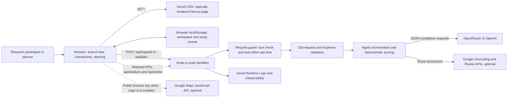

# TripTree Vercel Deployment Runbook

This runbook describes how to build, deploy, verify, operate, and roll back the current TripTree repository on Vercel. It is grounded in the repository state as of 2026-07-10.

## Deployment profile

| Item | Repository setting |
| --- | --- |
| Framework | Next.js App Router |
| Runtime | Node.js Vercel Functions |
| Node.js version | `24.x`, fixed by `package.json` |
| Compute model | Fluid Compute, enabled by `vercel.json` |
| Package manager | `pnpm@11.7.0` |
| Install command | `pnpm install --frozen-lockfile` |
| Build command | `pnpm build` |
| Static entry point | `/` |
| Dynamic endpoints | `/api/expand`, `/api/plan`, `/api/analyze`, `/api/probe` |
| Production branch | `main` |
| Git remote | `https://github.com/FabioZheng/chi.git` |
| Server-side persistence | None |
| Browser persistence | `localStorage` for the planning workspace; a dormant study logger also targets local storage |

`vercel.json` declares the framework and reproducible install/build commands. No custom output directory is required; Vercel must use the Next.js default.

## Runtime architecture



The primary branch-first interface currently calls `/api/expand` while the planning tree is emerging and `/api/plan` after a branch is committed. `/api/analyze` and `/api/probe` remain deployed but are not called by the current main page.

There is no shared planning database. Checkpoints and the current tree are restored from browser `localStorage`; clearing site data, selecting New Trip, or changing browsers removes or isolates that state. User prompts and the relevant planning state are sent to the selected LLM provider when an API request is made.

## Prerequisites

1. A Vercel account with permission to import `FabioZheng/chi` from GitHub.
2. A Vercel plan whose function-duration limit accepts the repository's 300-second `/api/plan` declaration. The current Fluid Compute limits permit 300 seconds on Hobby and higher configurable limits on paid plans, but verify the live limits before each release.
3. An OpenRouter API key, or an OpenAI API key if `LLM_PROVIDER=openai` is selected.
4. Optional Google Maps Platform credentials if real geocoding, route geometry, or the browser map is required.
5. For local release checks: Node.js 24 and pnpm 11.7.0.

Vercel currently lists Node.js 24 as its default available major. pnpm 11 requires Node.js 22 or newer, so this repository fixes Node.js 24 consistently in local requirements, CI, and Vercel. `package.json` takes precedence over a conflicting dashboard selection.

## Pre-deployment gate

Run from the repository root:

```bash
pnpm install --frozen-lockfile
pnpm typecheck
pnpm build
git status --short
```

The release is ready to import only when:

- type checking and the production build pass;
- `pnpm-lock.yaml` is committed and matches `package.json`;
- all required branch-generation files are tracked;
- `.env`, `.env.local`, `.vercel/`, logs, local editor state, and API keys are absent from the commit;
- a deliberate cost boundary is configured before sharing a deployment: Vercel Deployment Protection for a controlled study, or authentication plus a durable global limiter for an unrestricted public service;
- provider hard-spend limits and alerts are enabled for every deployed key;
- the intended commit is pushed to GitHub.

The repository's `.vercelignore` also excludes `.env*`, `.claude`, `.github`, `docs`, `tools`, logs, and Python files from direct CLI deployment uploads. This does not remove those files from Git history.

## Import through the Vercel dashboard

1. Push the reviewed release commit to GitHub. Use a feature branch first when a Preview deployment is desired; merge to `main` only after the Preview smoke test passes.
2. In Vercel, select **Add New > Project**.
3. Select the correct account or team and import `FabioZheng/chi`.
4. Set **Framework Preset** to **Next.js**. Auto-detection should already choose it.
5. Set **Root Directory** to `.` because `package.json`, `pnpm-lock.yaml`, and `vercel.json` are at repository root.
6. Leave **Output Directory** unset. Next.js owns the build output.
7. Confirm the effective install command is `pnpm install --frozen-lockfile` and the build command is `pnpm build`. These values come from `vercel.json`.
8. In **Environment Variables**, enter the server variables described below. Add production credentials to Production and isolated, lower-quota credentials to Preview when Preview calls must be live.
9. Keep Vercel system environment variables exposed, or set `OPENROUTER_SITE_URL` explicitly. The application can derive the site URL from `VERCEL_PROJECT_PRODUCTION_URL` or `VERCEL_URL`.
10. Select **Deploy**.
11. After the first build, open **Settings > Environments > Production > Branch Tracking** and confirm `main` is the production branch.
12. In **Settings > Build and Deployment**, confirm the deployment used Node.js 24.x. `package.json` should force this even if the dashboard default differs.
13. In **Settings > Functions**, confirm Fluid Compute is enabled. The repository also sets `"fluid": true` in `vercel.json` so the long-running AI routes receive Fluid Compute limits for this deployment.
14. Attach the production domain, then apply that domain to API-key restrictions before enabling Google-backed features.

Every environment-variable change requires a new deployment. Existing deployments retain the values captured when they were built.

## Environment variables

Use Vercel Project Settings rather than committing an environment file. Mark API keys sensitive where the dashboard supports it.

| Variable | Required | Exposure | Evaluation | Recommended scope and value |
| --- | --- | --- | --- | --- |
| `LLM_PROVIDER` | Yes | Server, non-secret | Runtime | `openrouter` or `openai`; set in Production and any live Preview environment |
| `OPENROUTER_API_KEY` | When using OpenRouter | Server secret | Runtime | Separate Production and Preview keys or quotas where possible |
| `OPENROUTER_MODEL` | No | Server, non-secret | Runtime | Defaults to `openai/gpt-4.1-mini`; set explicitly for reproducible experiments |
| `OPENROUTER_SITE_URL` | No | Server, non-secret | Runtime | Production URL including `https://`; when empty, code falls back to Vercel system URLs |
| `OPENROUTER_APP_NAME` | No | Server, non-secret | Runtime | Defaults to `TripTree` |
| `OPENAI_API_KEY` | When using OpenAI | Server secret | Runtime | Required only when `LLM_PROVIDER=openai` |
| `OPENAI_MODEL` | No | Server, non-secret | Runtime | Defaults to `gpt-4.1-mini`; set explicitly for reproducible experiments |
| `PARALLEL_PLANNER` | No | Server, non-secret | Runtime | `1` permits two alternatives when no skeleton is supplied; `0` forces a single planner call |
| `GOOGLE_MAPS_API_KEY` | No | Server secret | Runtime | Enables server-side geocoding and Routes API enrichment; restrict the key to only the required Google APIs |
| `NEXT_PUBLIC_GOOGLE_MAPS_API_KEY` | No | Public by design | Build time and browser | Needed only by the interactive browser map surface; restrict by allowed HTTP referrers and Maps JavaScript API |

`NEXT_PUBLIC_GOOGLE_MAPS_API_KEY` is embedded in browser JavaScript and is observable by every visitor. It is not a secret. Use a dedicated browser key with strict HTTP-referrer and API restrictions. Prefer a separate server key for `GOOGLE_MAPS_API_KEY`, because server and browser keys need different restriction models. If Preview URLs cannot be safely allowlisted, omit the browser key from Preview and test the map only on a controlled domain.

Vercel supplies `VERCEL_PROJECT_PRODUCTION_URL` and `VERCEL_URL` when system variables are exposed. Do not create API keys for these names. The application adds `https://` because Vercel's values do not include a scheme.

For local development, copy the variable names from `.env.example` into an ignored `.env` or `.env.local`. Never put real values in `.env.example`.

## Function durations and cancellation

The route handlers use statically analyzable Next.js `maxDuration` exports. Vercel reads these values from the Next.js build output. The `functions` entry in `vercel.json` also enables request cancellation for `src/app/api/**/*`, allowing a browser disconnect to reach `request.signal` in the Node.js functions.

| Route | Route `maxDuration` | Browser timeout | Upstream LLM timeout | Notes |
| --- | ---: | ---: | ---: | --- |
| `/api/expand` | 120 s | 110 s | 105 s per call | One Branch Explorer LLM call followed by deterministic filtering and scoring |
| `/api/plan` | 300 s | 270 s | 105 s per call | Planning/consistency stage, then constraint checking and optional Google enrichment, then deterministic analysis |
| `/api/analyze` | 120 s | 110 s | 105 s per call | Retained API; one conflict-detection call |
| `/api/probe` | 240 s | 230 s | 105 s per call | Retained API; preference probe and critic calls execute sequentially |

The effective user-visible limit is the first limit reached: browser timeout, caller cancellation, upstream timeout, or Vercel function duration. Individual Google geocoding and routing requests use a 20-second bound and fall back to estimated or unavailable route data when that bound is reached. The current UI's Pause operation aborts its browser request. The route passes `request.signal` through the agent and Google fetch layers so cooperative downstream work can stop, but cancellation is not transactional: a provider may have already received or billed a request before the abort arrives.

`/api/probe` permits two sequential 105-second upstream windows plus limited orchestration overhead. It is not in the current branch-first workflow; revalidate its timing and product need before reintroducing it into the user path.

Before deploying on a different Vercel plan, compare all four route declarations with the current platform maximum. Values above the plan maximum are not guaranteed to deploy or run as intended. A timeout returns a platform 504 even if the browser is willing to wait longer.

## Security boundaries and abuse controls

### Secrets and data flow

- `OPENROUTER_API_KEY`, `OPENAI_API_KEY`, and `GOOGLE_MAPS_API_KEY` are read only in Node.js route code. They must never use the `NEXT_PUBLIC_` prefix.
- `NEXT_PUBLIC_GOOGLE_MAPS_API_KEY` is a public client identifier. Its protection comes from Google referrer and API restrictions, not secrecy.
- The browser stores planning checkpoints and study events locally. Vercel does not provide shared persistence for these records.
- Prompts, preferences, committed branches, and itinerary context are transmitted to the configured LLM provider. Treat study consent, provider retention, and personally identifying travel details as research-governance concerns.
- API errors returned to the browser are sanitized for provider failures. Detailed provider errors go to server logs; do not export or share those logs without review.

### Current request guard

Every API route calls `guardApiRequest` before parsing JSON:

| Route namespace | Best-effort allowance per apparent client IP per minute |
| --- | ---: |
| `plan` | 6 |
| `expand` | 12 |
| `analyze` | 10 |
| `probe` | 10 |

The guard also rejects a declared `Content-Length` above 256,000 bytes. Zod schemas bound the principal prompt, guidance, branch-path, preference, and assumption fields. Vercel independently imposes its platform payload limit.

The rate limiter is a `globalThis` in-memory map. It is **per warm function instance, non-durable, and best-effort only**. It is not shared across instances or regions, can reset on a cold start or deployment, and cannot enforce a global quota. The `Content-Length` check also cannot measure an omitted or chunked header before parsing.

The routes currently have no user authentication. Before an unrestricted public launch, add at least one durable boundary:

1. Vercel Deployment Protection or participant authentication for controlled studies.
2. Vercel Firewall rules and bot controls at the edge.
3. A shared rate limiter backed by a durable store, keyed by authenticated participant and IP, with a global provider-cost budget.
4. Separate provider keys and hard spend limits for Production and Preview.

Do not describe the in-memory guard as a security-grade or globally consistent rate limiter in research materials.

## Preview and production smoke tests

Perform the full checklist on a Preview deployment before promoting the same commit to Production.

### Build and configuration

- [ ] The deployment status is Ready and the build log shows Node.js 24.x, pnpm 11.7.0, a successful Next.js build, and all four dynamic API routes.
- [ ] No secret value appears in the build log, browser source, or committed files.
- [ ] The selected provider key and model exist in the Preview environment.
- [ ] The browser console has no uncaught exception on first load.
- [ ] A malformed request reaches the function and returns application validation rather than a routing error:

```bash
BASE_URL="https://your-preview-url.vercel.app"
curl -i -X POST "$BASE_URL/api/expand" \
  -H "content-type: application/json" \
  --data '{}'
```

Expected result: HTTP 400 with code `VALIDATION`. HTTP 404 indicates routing/build configuration trouble; HTTP 500 with code `CONFIG` indicates a missing provider variable.

### Branch-first workflow

- [ ] Submit a concrete trip request and receive 2-4 candidate trip-shape branches.
- [ ] Pin one branch and verify the next planning dimension expands.
- [ ] Favor and prune candidates; verify the shared tree changes without creating separate agent trees.
- [ ] Pause during expansion. Confirm the UI stops waiting and can resume from the visible checkpoint.
- [ ] Add a steering rule such as a slower pace or fewer hotel changes. Confirm incompatible nodes are rescored or pruned and generation resumes from the affected stage.
- [ ] Restore a prior checkpoint and verify its tree and rules return.
- [ ] Commit a complete branch and build the itinerary.
- [ ] Confirm warnings, costs, route load, and itinerary details render without overflowing or blank states on desktop and mobile.
- [ ] Reload the page and verify the workspace restores from the same browser's local storage.
- [ ] Select New Trip and verify local workspace state clears.

### External services and controls

- [ ] Runtime logs show successful `/api/expand` and `/api/plan` invocations with durations below the 110-second and 270-second browser limits.
- [ ] If `GOOGLE_MAPS_API_KEY` is absent, itinerary generation still completes with explicit estimated or unavailable route metadata.
- [ ] If Google enrichment is enabled, real route geometry is returned and both required Google APIs are enabled and billed.
- [ ] If the browser map is enabled, test it on an allowed domain and verify denied domains cannot use the browser key.
- [ ] Triggering the local rate guard in Preview may produce HTTP 429 and `Retry-After`, but do not treat failure to reproduce 429 across requests as a defect: traffic may reach different instances.
- [ ] Production uses separate or intentionally shared provider quotas, and spend alerts are active at the provider.

After Preview passes, merge or push the same reviewed commit to `main`. Repeat the initial branch expansion, final itinerary, runtime-log, and Google-key checks on the production domain.

## Observability

### What to monitor

Use **Project > Logs** for per-request runtime logs and **Project > Observability > Functions** for aggregate behavior.

Track at minimum:

- invocation count by `/api/expand` and `/api/plan`;
- p50 and p95 duration, compared with the browser timeouts;
- HTTP 400, 429, 500, 502, and 504 rates;
- provider timeout and validation errors by agent and model;
- outbound latency to the LLM provider and Google APIs;
- provider token/credit consumption outside Vercel;
- pauses, checkpoint restores, prunes, repairs, and final-plan completion after the dormant study logger is wired into the active interface and consent permits collection.

The current branch-first page does not call the study logger, so Vercel telemetry alone cannot recover these interaction events. Instrumentation is a prerequisite for a controlled study, not a capability of the present deployment.

Vercel logs include route, status, duration, region, deployment, and outgoing-request information. The application currently writes internal agent errors with route and error code. Never log API keys, authorization headers, complete prompts, or unredacted participant data.

### Troubleshooting matrix

| Symptom | Likely cause | Action |
| --- | --- | --- |
| Build fails during install | Lockfile drift or package-manager mismatch | Confirm `packageManager` is `pnpm@11.7.0`, regenerate the lockfile intentionally with that version, review it, and commit it |
| Build selects wrong Node major | Dashboard and repository differ | Confirm `engines.node` is `24.x`; repository `package.json` should override the dashboard |
| `/api/*` returns 404 | Wrong Root Directory or framework configuration | Set Root Directory to `.` and Framework Preset to Next.js; inspect the build route table |
| API returns 500 `CONFIG` | Missing key for selected LLM provider | Add the required secret to the same Vercel environment and redeploy |
| API returns sanitized 502 | Upstream auth, quota, model, timeout, malformed JSON, or schema failure | Filter Runtime Logs by route and deployment; verify provider status, model access, quota, and the internal error code |
| API returns 504 | Vercel duration elapsed | Compare route `maxDuration`, plan limit, browser timeout, and outbound timings; reduce work or move longer work to a durable workflow |
| Browser reports request timeout | Client reached its 110 s, 230 s, or 270 s limit first | Inspect the matching function request; optimize the slow stage rather than only increasing Vercel duration |
| API returns 429 | Best-effort local bucket reached | Respect `Retry-After`; inspect traffic and provider cost; use a durable limiter if the load is legitimate or distributed |
| 429 protection appears inconsistent | Requests reached different instances or a cold start reset memory | Expected for the in-memory guard; deploy a shared limiter for consistent enforcement |
| Branch generation stops after Pause | Caller cancellation propagated | Use Resume from the checkpoint; verify a new `/api/expand` invocation appears |
| Google routes are estimated | Missing/invalid server key, disabled API, ambiguous geocode, quota, or billing | Check `GOOGLE_MAPS_API_KEY`, Geocoding API, Routes API, billing, restrictions, and server logs |
| Browser map says key is missing or denied | Missing build-time public key or referrer restriction mismatch | Set `NEXT_PUBLIC_GOOGLE_MAPS_API_KEY`, allow the exact domain, and redeploy because public variables are compiled at build time |
| Preview works but Production fails | Environment scopes differ | Compare Production and Preview variables in Project Settings, then redeploy Production |
| Old tree reappears after a release | Persisted browser workspace is compatible but stale for the test | Select New Trip or remove the `trip-tree:workspace:v2` local-storage key before a clean smoke test |

When escalating an incident, record the deployment URL, Git commit SHA, Vercel Request ID, route, status code, timestamp, selected model, and whether Google enrichment was enabled. Do not include secret values.

## Rollback and recovery

### Immediate service rollback

1. Confirm the regression in Production runtime logs and identify the first bad deployment.
2. From the project Overview or Deployments page, select **Instant Rollback** and choose the last known-good production deployment permitted by the plan.
3. Verify `/`, `/api/expand`, and `/api/plan` on the production domain using the smoke-test subset above.
4. Verify provider and Google credentials still work. Instant Rollback points traffic to an existing deployment; it does not rebuild that deployment with newly edited environment variables, so its captured configuration may be stale.
5. Record the rollback deployment and incident timestamp.

On Hobby, rollback eligibility can be limited to the immediately preceding production deployment; paid plans provide broader history. After an Instant Rollback, Vercel may suspend automatic production-domain assignment until the rollback is undone or another deployment is promoted. Confirm the project's production state before assuming the next `main` push is live.

### Durable source recovery

1. Revert the defective Git commit or prepare a corrective commit on a branch.
2. Deploy it as Preview and run the complete smoke checklist.
3. Merge the fix to `main`.
4. Promote the passing deployment or undo the rollback in Vercel so automatic production assignment resumes.
5. Verify Production and close the incident with the root cause and prevention action.

Rollback is not a secret-rotation mechanism. If a key is exposed, revoke or rotate it at the provider, update Vercel Environment Variables, and create a new deployment.

## Official references

- [Deploying Git repositories with Vercel](https://vercel.com/docs/git)
- [Vercel environment variables](https://vercel.com/docs/environment-variables)
- [Managing environment variables across environments](https://vercel.com/docs/environment-variables/manage-across-environments)
- [Vercel system environment variables](https://vercel.com/docs/environment-variables/system-environment-variables)
- [Vercel Functions limits](https://vercel.com/docs/functions/limitations)
- [Vercel Functions request cancellation](https://vercel.com/docs/functions/functions-api-reference#cancel-requests)
- [Configuring Vercel Function duration](https://vercel.com/docs/functions/configuring-functions/duration)
- [Next.js route segment config and `maxDuration`](https://nextjs.org/docs/app/api-reference/file-conventions/route-segment-config#maxduration)
- [Supported Node.js versions on Vercel](https://vercel.com/docs/functions/runtimes/node-js/node-js-versions)
- [pnpm installation and Node.js compatibility](https://pnpm.io/installation#compatibility)
- [Vercel Runtime Logs](https://vercel.com/docs/logs/runtime)
- [Vercel Instant Rollback](https://vercel.com/docs/instant-rollback)
- [Vercel Deployment Protection](https://vercel.com/docs/deployment-protection)

Platform limits and dashboard labels change over time. Recheck the official duration, environment, Node.js, and rollback documentation before each study launch or public release.
